# Character Perspective Skills

Archive repository for character-oriented prompt skills gathered from local agent skill trees.

## Overview

- **197** character skills
- **39** works
- Portraits: `assets/portraits/<work>/<character>.webp`

## Characters

### 青色魔法少女  (`amairo-islenauts`)

<a href="characters/amairo-islenauts/airi-perspective/">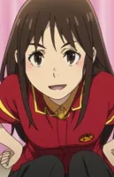</a> <a href="characters/amairo-islenauts/masaki-perspective/">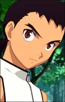</a> <a href="characters/amairo-islenauts/shirley-perspective/">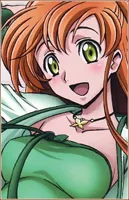</a> <a href="characters/amairo-islenauts/yune-perspective/">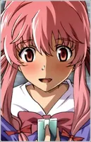</a>

### Angel Beats!  (`angel-beats`)

<a href="characters/angel-beats/tachibana-kanade-perspective/">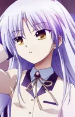</a>

### 偶像梦幻乐团  (`ave-mujica`)

<a href="characters/ave-mujica/misumi-uika-perspective/">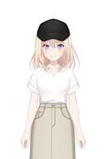</a> <a href="characters/ave-mujica/togawa-sakiko-perspective/">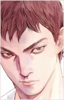</a> <a href="characters/ave-mujica/wakaba-mutsumi-perspective/">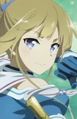</a> <a href="characters/ave-mujica/yahata-umiri-perspective/">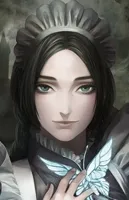</a> <a href="characters/ave-mujica/yutenji-nyamu-perspective/">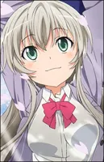</a>

### 孤独摇滚！  (`bocchi-the-rock`)

<a href="characters/bocchi-the-rock/hitori-gotoh-perspective/">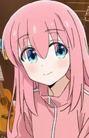</a> <a href="characters/bocchi-the-rock/ikuyo-kita-perspective/">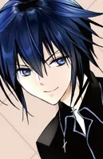</a> <a href="characters/bocchi-the-rock/kikuri-hiroi-perspective/">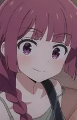</a> <a href="characters/bocchi-the-rock/nijika-ijichi-perspective/">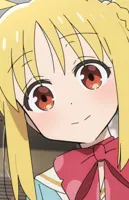</a> <a href="characters/bocchi-the-rock/pa-san-perspective/">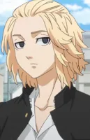</a> <a href="characters/bocchi-the-rock/ryo-yamada-perspective/">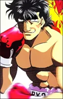</a> <a href="characters/bocchi-the-rock/seika-ijichi-perspective/">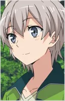</a>

### Charlotte  (`charlotte`)

<a href="characters/charlotte/tomori-nao-perspective/">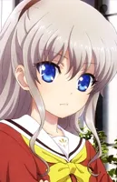</a>

### 德古拉之怒  (`dracu-riot`)

<a href="characters/dracu-riot/azusa-perspective/">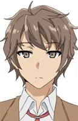</a> <a href="characters/dracu-riot/elina-perspective/">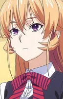</a> <a href="characters/dracu-riot/miu-perspective/">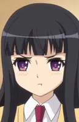</a> <a href="characters/dracu-riot/rio-perspective/">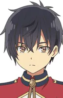</a>

### FATE  (`fate`)

<a href="characters/fate/artoria-pendragon-perspective/">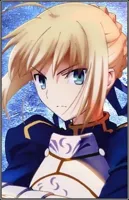</a>

### FGO  (`fate-grand-order`)

<a href="characters/fate-grand-order/mash-kyrielight-perspective/">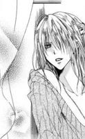</a>

### FS/N  (`fate-stay-night`)

<a href="characters/fate-stay-night/emiya-shirou-perspective/">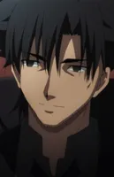</a>  <a href="characters/fate-stay-night/kotomine-kirei-perspective/">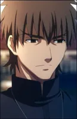</a> <a href="characters/fate-stay-night/rin-tohsaka-perspective/">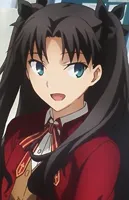</a> <a href="characters/fate-stay-night/sakura-matou-perspective/">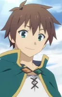</a>

### 为美好的世界献上祝福  (`konosuba`)

<a href="characters/konosuba/megumin-perspective/">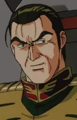</a>

### 魔法少女小圆  (`madoka`)

<a href="characters/madoka/homura-akemi-perspective/">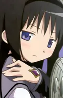</a>    <a href="characters/madoka/mami-perspective/">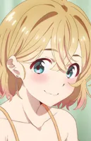</a> <a href="characters/madoka/sayaka-miki-perspective/">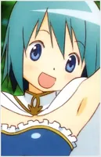</a>

### 魔女之旅  (`majo-no-tabitabi`)

### 无职转生  (`majono-yoru-en`)

<a href="characters/majono-yoru-en/meguru-perspective/">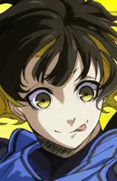</a> <a href="characters/majono-yoru-en/touko-perspective/">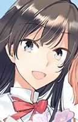</a>  <a href="characters/majono-yoru-en/wakana-perspective/">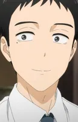</a>

### MyGO!!!!!  (`mygo`)

<a href="characters/mygo/chihaya-anon-perspective/">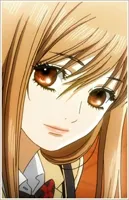</a> <a href="characters/mygo/kaname-rana-perspective/">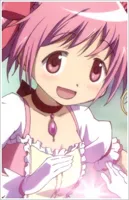</a> <a href="characters/mygo/nagasaki-soyo-perspective/">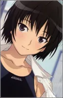</a> <a href="characters/mygo/shiina-taki-perspective/">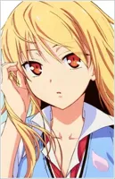</a> <a href="characters/mygo/takamatsu-tomori-perspective/">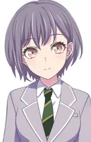</a>

### 新世纪福音战士  (`neon-genesis-evangelion`)

<a href="characters/neon-genesis-evangelion/asuka-langley-soryu-perspective/">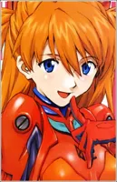</a> <a href="characters/neon-genesis-evangelion/gendo-ikari-perspective/">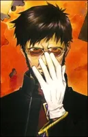</a> <a href="characters/neon-genesis-evangelion/kaworu-nagisa-perspective/">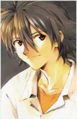</a> <a href="characters/neon-genesis-evangelion/misato-katsuragi-perspective/">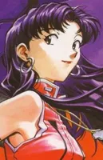</a> <a href="characters/neon-genesis-evangelion/rei-ayanami-perspective/">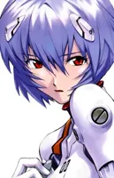</a> <a href="characters/neon-genesis-evangelion/shinji-ikari-perspective/">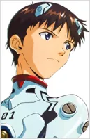</a>

### NOBLE WORKS  (`noble-works`)

<a href="characters/noble-works/akari-perspective/">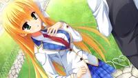</a> <a href="characters/noble-works/hinata-perspective/">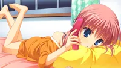</a> <a href="characters/noble-works/maya-perspective/">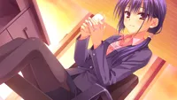</a> <a href="characters/noble-works/sena-perspective/">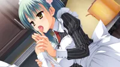</a> 

### 乙女理論とその周辺  (`otome-riron`)

   

### 关于邻家的天使大人  (`otonari-no-tenshi-sama`)

### Overlord  (`overlord`)

            

### 谜之屋  (`riddle-joker`)

    

### 樱之刻  (`sakura-no-toki`)

       

### 樱之诗  (`sakura-no-uta`)

       

### 圣痕炼金术师  (`sanoba-witch`)

### 千恋＊万花  (`senren-banka`)

     

### 终结的炽天使  (`seraph-of-the-end`)

### 名侦探光之美少女  (`star-detective-precure`)

### 命运石之门  (`steins-gate`)

### 龙与虎  (`toradora`)

### 刀剑神域  (`sword-art-online`)

                         

### 转生史莱姆  (`tensei-shitara-slime-datta-ken`)

### 东方Project  (`touhou-project`)

   

### 月に寄りそう乙女の作法  (`tsuki-ni-yorisou-otome-no-sahou`)

### 魔法禁书目录  (`toaru-project`)

### 我想成为影之实力者！  (`kage-no-jitsuryokusha`)

### 不正经的魔术讲师与禁忌教典  (`rokudenashi-majutsu-koushi`)

### 初音未来  (`vocaloid`)

### 零之使魔 / Zero no Tsukaima  (`zero-no-tsukaima`)

<a href="characters/zero-no-tsukaima/louise-perspective/"> Louise / 露易丝</a>

