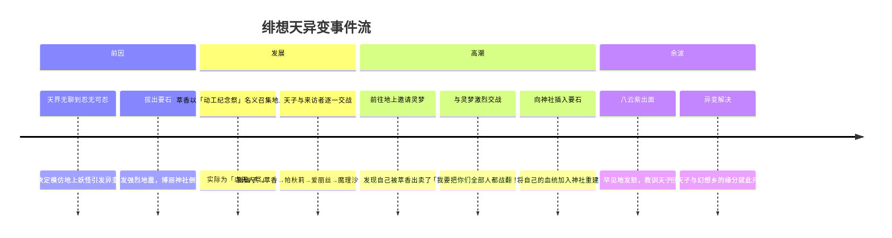

# 06 Timeline — 比那名居天子 角色时间线

> 说明：本文件以作品发行时间线为骨架，结合角色经历的内在时间顺序整理。设定时间以作品发布年为基准，幻想乡内部的年史不可严格对应现实年份。
> 置信度：作品发行时间 > 角色经历内在顺序 > 推断

---

## 一、前史：成为天人之前

### 比那名居一族的升天

- **名居守**任职期间，比那名居一族作为其侍从，负责协助镇压地震
- 名居守死后被供奉为神（地震之神/要石之神）
- 比那名居一族**附带升格**，得以移居天界——这是一个典型的「鸡犬升天」案例（官方用语）
- 比那名居地子（当时的名字）随家族移居天界，改名为「天子」
- 因没有经过天人应有的修行，比那名居一族被天界原住民视为「不良天人」

### 天界生活的开始

- 天子在天界度过了一段**极其无聊的时光**
- 天界的生活：每日跳舞、宴会、吃桃子——永远平静，永远不变
- 她开始偷偷观察幻想乡的生活，发现了地上的异变文化

---

## 二、《东方绯想天》（2008年）

> 作品编号：TH10.5，格斗游戏，黄昏边境 × ZUN

### 核心事件：绯想天异变

这是天子的人生转折点，也是她与幻想乡的首次大规模交集。



### 关键事件细节

1. **引发地震**：拔出要石，动摇幻想乡地基，博丽神社倒塌
2. **重建自己的神社**：在废墟上重建了带天界风格的神社，试图将其打造成自己的居所
3. **与来访者交战**：天界「动工纪念祭」上，被萃香召集来的角色们逐一与天子交战——但她不知道这实际上是「虐天人祭」
4. **发现被骗**：从灵梦处得知被萃香骗了，仍硬着头皮完成了全部对战
5. **插要石**：战后将要石插入博丽神社地下，实质上是把天界与幻想乡连接起来
6. **被紫制裁**：八云紫对此猛烈反应，最终由灵梦等人解决了异变

### 本作中建立的关键关系

- 与伊吹萃香建立酒肉朋友关系
- 与博丽灵梦建立竞争对手关系
- 与永江衣玖建立正式的地震业务联络关系
- 与八云紫建立对立关系

---

## 三、《东方非想天则》（2009年）

> 作品编号：TH12.3，格斗资料片

### 追加事件

- 天子作为可玩角色参战
- 剧情方面进一步补充了她与衣玖之间的业务往来
- 展现了更多天界日常管理的细节（大地震的预防、要石的管理等）
- 暗示天子与衣玖之间的关系比起《绯想天》初期有所升温——至少衣玖不再需要确认天子的名字了

---

## 四、《东方文花帖DS》（2009年）

> 作品编号：TH12.5

### 天子作为摄影目标

- **称号变更**：此作中天子的称号为「有顶天的大小姐」
- Level 10 的全部7张符卡供射命丸文和姬海棠果拍摄
- 符卡「全人类的绯想天」的说明文：「抓拍到了人类气质泄露的瞬间！看起来很烫人的样子但却并非如此呢」

### 符卡列表

| 编号 | 符卡名 | 日文名 |
|------|--------|--------|
| 10-1 | 气性「勇气凛凛之剑」 | 気性「勇気凛々の剣」 |
| 10-3 | 地震「避难险路」 | 地震「避難険路」 |
| 10-5 | 要石「要石浮游炮」 | 要石「カナメファンネル」 |
| 10-7 | 「全人类的绯想天」 | 「全人類の緋想天」 |

注：10-2、10-4、10-6为永江衣玖的符卡——两人在同一关卡出现，暗示其业务关联性。

---

## 五、《东方求闻口授》（2012年）

> 官方设定集

### 文文新闻报道

射命丸文在天子下场采访她——这是最早的天子「性格诊断」系统的一设说明来源：

- 天子在人类村落附近强行销售「天气预报」（实际上是性格诊断）
- 她声称能从人的气质判断他们会带来什么天气
- 如果被怀疑，她会强制显现对方的气质——这被很多人投诉是天气操控

**重要性：** 此报道首次明确解释了「绯想之剑 = 洞察气质」的运作机制，是理解天子能力的重要一设来源。

---

## 六、《东方心绮楼》（2013年）

> 作品编号：TH13.5

- 天子作为背景观众出场，未作为可玩角色
- 但这表明她持续待在幻想乡而不是返回天界，暗示她在绯想天之后将活动空间转移到了地上

---

## 七、《弹幕天邪鬼》（2014年）

> 作品编号：TH14.3

### 最终日Boss

- 天子出现在最终日的场景3和场景8
- 新符卡：「全妖怪的绯想天」——说明她开始收集妖怪的气质了
- 另一符卡：「鹿岛镇护」——与鹿岛神宫的「要石」传说直接关联

---

## 八、《东方茨歌仙》（漫画连载，2010年代）

### 重要事件：被天界放逐

- 天子因**偷吃天界宴会上的所有丹药**，被天界正式放逐
- 这意味着她不能再随意回到天界居住
- 被迫在地上有更长的停留时间——或者说，这正是她想要的

### 与依神紫苑相遇

- 完全凭依异变后，天子在地上遇到了贫穷神依神紫苑
- 因为天子的强运不受紫苑不幸能力的影响，天子对紫苑很中意
- 两人开始一同行动——虽然紫苑的存在把一切准备事项都搞砸了
- 她们曾包办赏花会的酒宴筹办，但频频失败

---

## 九、《东方凭依华》（2017年）

> 作品编号：TH15.5

### 全新定位：可玩二人组角色之一

- **称号更新**：「绯想一般远离浮世的天人」
- 与**少名针妙丸**组队，形成「最强二人」组合
- 参与完全凭依异变

### 新符卡群

本作中天子展示了她与针妙丸的联动符卡，以及个人新符卡，包括：
- 全人类/全妖怪以外的新「绯想天」变体
- 与小人族配合的团队攻击

### 梦境世界的危机

- 梦境世界的天子暴走，试图清洗整个世界
- 依神姐妹将其击倒后才平息事态

---

## 十、后续出场（2018—2023年）

### 《秘封噩梦日记》（2018年）

- 噩梦周二的Boss，继续与梦境相关的事件

### 《弹幕狂们的黑市》（2020年）

- 5th Market的Boss
- 称号更新为「相比天界更喜欢地上」——这是一个值得关注的转变，从行动上确认了她选择地上而非天界

### 《东方人妖名鉴 宵暗篇》（2020年）

- 官方设定集收录，第44-45页
- 此书中天子的官方种族仍标注为「落魄天人」

### 《东方智灵奇传》（2021年）

- 在第1-1话客串登场

---

## 十一、性格演变轨迹

```
天界时代             → 自由，但孤独，极度无聊
    ↓
绯想天异变期         → 充满期待，兴奋，也有些心虚
    ↓
异变后（绯想天结局） → 倔强不服输，但开始对地上产生兴趣
    ↓
非想天则时期         → 慢慢融入天界与地上的日常管理事务
    ↓
文花帖DS时期         → 主动到地上搞事(性格诊断服务)
    ↓
茨歌仙（被放逐）     → 被迫落地→实际正中下怀
    ↓
凭依华时期           → 已经完全接受「参与地上事件」的定位
    ↓
弹幕狂们的黑市       → 公开承认「相比天界更喜欢地上」
```

---

## 十二、关键节点总结

| 时间 | 事件 | 对角色意义 |
|------|------|-----------|
| 前史 | 比那名居一族升天 | 获得天人身份但未经修行，成为不良天人 |
| 天界时代 | 长期无聊生活 | 形成「害怕孤独、渴望参与他人生活」的核心人格 |
| 2008 | 绯想天异变 | 首次与幻想乡大规模互动，建立所有关键关系 |
| 2009-2014 | 持续参与地上事件 | 从「偶然的闯入者」变为「常驻编外成员」 |
| 2017 | 凭依华异变 | 与针妙丸组队，确立可玩角色地位 |
| 茨歌仙时期 | 被天界放逐 | 形式上从「天人来访」变成「地上居民」 |
| 2020 | 《弹幕狂们的黑市》 | 公开表达对地上的偏好，选择明确 |
| 2026-06-19 | 调研日期 | — |
