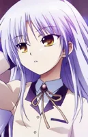

# 角色 Skill 清单

> 自动生成于 2026-06-11 15:28
>
> 共 **32** 部作品，**138** 个角色

---

## 青色魔法少女（4 角色）

| 头像 | 角色 | Skill 标识 |
|------|------|-----------|
|  | Airi | `airi-perspective` |
|  | Masaki | `masaki-perspective` |
|  | Shirley | `shirley-perspective` |
|  | Yune | `yune-perspective` |
---

## Angel Beats!（1 角色）

| 头像 | 角色 | Skill 标识 |
|------|------|-----------|
|  | Tachibana Kanade | `tachibana-kanade-perspective` |
---

## 偶像梦幻乐团（5 角色）

| 头像 | 角色 | Skill 标识 |
|------|------|-----------|
|  | Misumi Uika | `misumi-uika-perspective` |
|  | Togawa Sakiko | `togawa-sakiko-perspective` |
|  | Wakaba Mutsumi | `wakaba-mutsumi-perspective` |
|  | Yahata Umiri | `yahata-umiri-perspective` |
|  | Yutenji Nyamu | `yutenji-nyamu-perspective` |
---

## 孤独摇滚！（7 角色）

| 头像 | 角色 | Skill 标识 |
|------|------|-----------|
|  | Hitori Gotoh | `hitori-gotoh-perspective` |
|  | Ikuyo Kita | `ikuyo-kita-perspective` |
|  | Kikuri Hiroi | `kikuri-hiroi-perspective` |
|  | Nijika Ijichi | `nijika-ijichi-perspective` |
|  | Pa San | `pa-san-perspective` |
|  | Ryo Yamada | `ryo-yamada-perspective` |
|  | Seika Ijichi | `seika-ijichi-perspective` |
---

## Charlotte（2 角色）

| 头像 | 角色 | Skill 标识 |
|------|------|-----------|
|  | Tachibana Kanade | `tachibana-kanade-perspective` |
|  | Tomori Nao | `tomori-nao-perspective` |
---

## 德古拉之怒（4 角色）

| 头像 | 角色 | Skill 标识 |
|------|------|-----------|
|  | Azusa | `azusa-perspective` |
|  | Elina | `elina-perspective` |
|  | Miu | `miu-perspective` |
|  | Rio | `rio-perspective` |
---

## FATE（1 角色）

| 头像 | 角色 | Skill 标识 |
|------|------|-----------|
|  | Artoria Pendragon | `artoria-pendragon-perspective` |
---

## FGO（1 角色）

| 头像 | 角色 | Skill 标识 |
|------|------|-----------|
|  | Mash Kyrielight | `mash-kyrielight-perspective` |
---

## FS/N（5 角色）

| 头像 | 角色 | Skill 标识 |
|------|------|-----------|
|  | Emiya Shirou | `emiya-shirou-perspective` |
|  | Illyasviel Von Einzbern | `illyasviel-von-einzbern-perspective` |
|  | Kotomine Kirei | `kotomine-kirei-perspective` |
|  | Rin Tohsaka | `rin-tohsaka-perspective` |
|  | Sakura Matou | `sakura-matou-perspective` |
---

## 为美好的世界献上祝福（1 角色）

| 头像 | 角色 | Skill 标识 |
|------|------|-----------|
|  | Megumin | `megumin-perspective` |
---

## 魔法少女小圆（4 角色）

| 头像 | 角色 | Skill 标识 |
|------|------|-----------|
|  | Homura Akemi | `homura-akemi-perspective` |
|  | Madoka Kaname | `madoka-kaname-perspective` |
|  | Mami | `mami-perspective` |
|  | Sayaka Miki | `sayaka-miki-perspective` |
---

## 魔女之旅（1 角色）

| 头像 | 角色 | Skill 标识 |
|------|------|-----------|
|  | Elaina | `elaina-perspective` |
---

## 无职转生（4 角色）

| 头像 | 角色 | Skill 标识 |
|------|------|-----------|
|  | Meguru | `meguru-perspective` |
|  | Touko | `touko-perspective` |
|  | Tsumugi | `tsumugi-perspective` |
|  | Wakana | `wakana-perspective` |
---

## MyGO!!!!!（5 角色）

| 头像 | 角色 | Skill 标识 |
|------|------|-----------|
|  | Chihaya Anon | `chihaya-anon-perspective` |
|  | Kaname Rana | `kaname-rana-perspective` |
|  | Nagasaki Soyo | `nagasaki-soyo-perspective` |
|  | Shiina Taki | `shiina-taki-perspective` |
|  | Takamatsu Tomori | `takamatsu-tomori-perspective` |
---

## 新世纪福音战士 / EVA（6 角色）

| 头像 | 角色 | Skill 标识 |
|------|------|-----------|
|  | Asuka Langley Soryu | `asuka-langley-soryu-perspective` |
|  | Gendo Ikari | `gendo-ikari-perspective` |
|  | Kaworu Nagisa | `kaworu-nagisa-perspective` |
|  | Misato Katsuragi | `misato-katsuragi-perspective` |
|  | Rei Ayanami | `rei-ayanami-perspective` |
|  | Shinji Ikari | `shinji-ikari-perspective` |
---

## NOBLE WORKS（5 角色）

| 头像 | 角色 | Skill 标识 |
|------|------|-----------|
|  | Akari | `akari-perspective` |
|  | Hinata | `hinata-perspective` |
|  | Maya | `maya-perspective` |
|  | Sena | `sena-perspective` |
|  | Shizuru | `shizuru-perspective` |
---

## 乙女理論とその周辺 / 月に寄りそう乙女の作法（4 角色）

| 头像 | 角色 | Skill 标识 |
|------|------|-----------|
|  | Kokura Asahi | `kokura-asahi-perspective` |
|  | Ookura Aeon | `ookura-aeon-perspective` |
|  | Ookura Resona | `ookura-resona-perspective` |
|  | Ookura Yusei | `ookura-yusei-perspective` |
---

## 关于邻家的天使大人（1 角色）

| 头像 | 角色 | Skill 标识 |
|------|------|-----------|
|  | Shiina Mahiru | `shiina-mahiru-perspective` |
---

## Overlord（13 角色）

| 头像 | 角色 | Skill 标识 |
|------|------|-----------|
|  | Ainz Ooal Gown | `ainz-ooal-gown-perspective` |
|  | Albedo | `albedo-perspective` |
|  | Aura Bella Fiora | `aura-bella-fiora-perspective` |
|  | Demiurge | `demiurge-perspective` |
|  | Evileye | `evileye-perspective` |
|  | Lupusregina Beta | `lupusregina-beta-perspective` |
|  | Mare Bello Fiore | `mare-bello-fiore-perspective` |
|  | Narberal Gamma | `narberal-gamma-perspective` |
|  | Pandoras Actor | `pandoras-actor-perspective` |
|  | Renner Theiere Chardelon Ryle Vaiself | `renner-theiere-chardelon-ryle-vaiself-perspective` |
|  | Shalltear Bloodfallen | `shalltear-bloodfallen-perspective` |
|  | Solution Epsilon | `solution-epsilon-perspective` |
|  | Zesshi Zetsumei | `zesshi-zetsumei-perspective` |
---

## 谜之屋（5 角色）

| 头像 | 角色 | Skill 标识 |
|------|------|-----------|
|  | Ayase | `ayase-perspective` |
|  | Chisaki | `chisaki-perspective` |
|  | Hazuki | `hazuki-perspective` |
|  | Mayu | `mayu-perspective` |
|  | Nanami | `nanami-perspective` |
---

## 樱之刻（8 角色）

| 头像 | 角色 | Skill 标识 |
|------|------|-----------|
|  | Hikawa Ruriwo | `hikawa-ruriwo-perspective` |
|  | Honma Misuzu | `honma-misuzu-perspective` |
|  | Kawachino Suzuna | `kawachino-suzuna-perspective` |
|  | Kuriyama Natsuko | `kuriyama-natsuko-perspective` |
|  | Nakamura Reika | `nakamura-reika-perspective` |
|  | Sakizaki Sakurako | `sakizaki-sakurako-perspective` |
|  | Toritani Saki | `toritani-saki-perspective` |
|  | Toritani Shizuru | `toritani-shizuru-perspective` |
---

## 樱之诗（8 角色）

| 头像 | 角色 | Skill 标识 |
|------|------|-----------|
|  | Hikawa Rina | `hikawa-rina-perspective` |
|  | Kawachino Yuumi | `kawachino-yuumi-perspective` |
|  | Kusanagi Naoya | `kusanagi-naoya-perspective` |
|  | Misakura Rin | `misakura-rin-perspective` |
|  | Natsume Ai | `natsume-ai-perspective` |
|  | Natsume Kei | `natsume-kei-perspective` |
|  | Natsume Shizuku | `natsume-shizuku-perspective` |
|  | Toritani Makoto | `toritani-makoto-perspective` |
---

## 圣痕炼金术师（1 角色）

| 头像 | 角色 | Skill 标识 |
|------|------|-----------|
|  | Sakurai Nene | `sakurai-nene-perspective` |
---

## 宿命回响（6 角色）

| 头像 | 角色 | Skill 标识 |
|------|------|-----------|
|  | Koharu | `koharu-perspective` |
|  | Lena | `lena-perspective` |
|  | Mako | `mako-perspective` |
|  | Murasame | `murasame-perspective` |
|  | Roka | `roka-perspective` |
|  | Yoshino | `yoshino-perspective` |
---

## 终结的炽天使（1 角色）

| 头像 | 角色 | Skill 标识 |
|------|------|-----------|
|  | Krul Tepes | `krul-tepes-perspective` |
---

## 名侦探光之美少女（1 角色）

| 头像 | 角色 | Skill 标识 |
|------|------|-----------|
|  | Luluka | `luluka-perspective` |
---

## 命运石之门（1 角色）

| 头像 | 角色 | Skill 标识 |
|------|------|-----------|
|  | Makise Kurisu | `makise-kurisu-perspective` |
---

## Sword Art Online / 刀剑神域（26 角色）

| 头像 | 角色 | Skill 标识 |
|------|------|-----------|
|  | Alice Synthesis Thirty | `alice-synthesis-thirty-perspective` |
|  | Andrew Gilbert Mills | `andrew-gilbert-mills-perspective` |
|  | Argo | `argo-perspective` |
|  | Asada Shino | `asada-shino-perspective` |
|  | Asuna Yuuki | `asuna-yuuki-perspective` |
|  | Bercouli Synthesis One | `bercouli-synthesis-one-perspective` |
|  | Cardinal | `cardinal-perspective` |
|  | Eiji Nogata | `eiji-nogata-perspective` |
|  | Eugeo | `eugeo-perspective` |
|  | Gabriel Miller | `gabriel-miller-perspective` |
|  | Kayaba Akihiko | `kayaba-akihiko-perspective` |
|  | Kirigaya Kazuto | `kirigaya-kazuto-perspective` |
|  | Kirigaya Suguha | `kirigaya-suguha-perspective` |
|  | Lizbeth Rika Shinozaki | `lizbeth-rika-shinozaki-perspective` |
|  | Quinella | `quinella-perspective` |
|  | Renly Synthesis Twenty Seven | `renly-synthesis-twenty-seven-perspective` |
|  | Rosalia | `rosalia-perspective` |
|  | Sachi | `sachi-perspective` |
|  | Selka Zuberg | `selka-zuberg-perspective` |
|  | Sheyta Synthesis Twelve | `sheyta-synthesis-twelve-perspective` |
|  | Silica Keiko Ayano | `silica-keiko-ayano-perspective` |
|  | Tsuboi Ryoutarou | `tsuboi-ryoutarou-perspective` |
|  | Vassago Casals | `vassago-casals-perspective` |
|  | Yui | `yui-perspective` |
|  | Yuna | `yuna-perspective` |
|  | Yuuki | `yuuki-perspective` |
---

## 转生史莱姆（1 角色）

| 头像 | 角色 | Skill 标识 |
|------|------|-----------|
|  | Rimuru Tempest | `rimuru-tempest-perspective` |
---

## 东方Project（4 角色）

| 头像 | 角色 | Skill 标识 |
|------|------|-----------|
|  | Flandre Scarlet | `flandre-scarlet-perspective` |
|  | Hakurei Reimu | `hakurei-reimu-perspective` |
|  | Izayoi Sakuya | `izayoi-sakuya-perspective` |
|  | Yakumo Yukari | `yakumo-yukari-perspective` |
---

## 月依（1 角色）

| 头像 | 角色 | Skill 标识 |
|------|------|-----------|
|  | Sakurakouji Runa | `sakurakouji-runa-perspective` |
---

## 初音未来（1 角色）

| 头像 | 角色 | Skill 标识 |
|------|------|-----------|
|  | Hatsune Miku | `hatsune-miku-perspective` |

---

> 头像存储在 `roles/assets/portraits/` 目录下，按作品分组，WebP 格式，约 200×200px。
